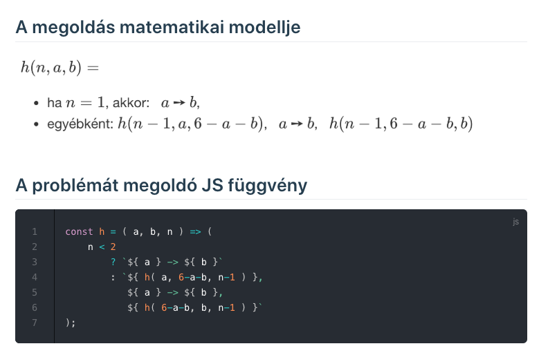
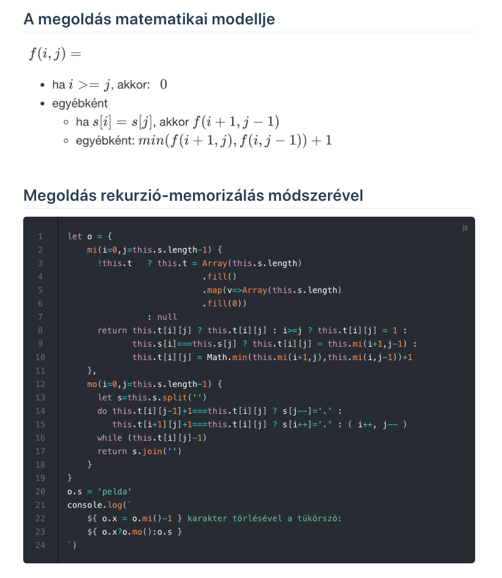
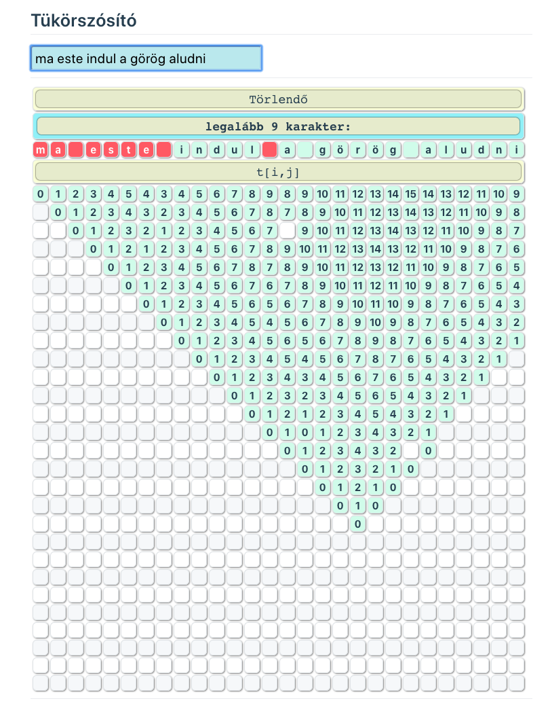

TÁMOGATÁS:
Jelen tananyag a Szegedi Tudományegyetemen készült az Európai Unió támogatásával. A pályázat címe: A Szegedi Tudományegyetem készségfejlesztő és kommunikációs programjainak megvalósítása a felsőoktatásba való bekerülés előmozdítására és az MTMI szakok népszerűsítésére. Pályázati azonosító: ```EFOP-3.4.4-16-2017-00015```

LEÍRÁS:
Az alábbi tananyagrészlet az "Algoritmusok és adatszerkezetek az alkalmazásfejlesztésben” témához kapcsolódóan, leírásokokon és példaprogramokon keresztül mutatja be, hogy hogyan tudjuk alkalmazni az algoritmikus gondolkodást és algoritmizálási ismereteinket az alkalmazásfejlesztésben, konkrétan a JavaScript és VueJS-SFC szintaxis felhasználásával, komplex alkalmazási példákkal segítve a tanárok munkáját.
TARTALOMJEGYZÉK  (feladatleírás és munkaterv alapján)


# 3. Fejezet

## 3.1. Webes alkalmazások: Webes alkalmazások felépítése, működési elve, kliens és szerver oldal, RESTful API-k, axios

Az MVC a Model View Controller szavakból összetevődő kifejezés egy rendkívül népszerű szoftvertervezési mintára. Egy webfejlesztő szemszögéből nézve az eltérő nyelvek esetén nincs két egyforma megvalósítási forma, sok programozó szerint igazi MVC nem is értelmezhető a webfejlesztésben. Az általános koncepciója az, hogy elválasszuk egymástól a funkcionalitást, a vezérlést, a felhasználói felületet, stb. az alkalmazásunkban. Ez megadja a lehetőséget, hogy fejlesztőket csoportosítsunk egyetlen problémára. Az egyetlen hátránya az adatok megfelelő struktúrájának tervezésének és implementálásának időigényességéből adódik. A Model az adatok manipulásásáért felel, alapvetően az alkalmazásunk agyaként funkcionál (az üzleti logikát megvalósító réteg). A Model feladata az, hogy és leírjuk és definiáljuk azokat a szabályokat, melyek alapján elérhetjük azokat. Általában kapcsolatban áll valamilyen típusú adatbázissal (NoSQL vagy SQL) és intézi a lekérdezéseket. Továbbá kapcsolatot tart fent a Controller-el azon keresztül, hogy az is lekérhet adatokat a Model-en keresztül, hogy frissítse a View-t. Az MVC View része az alkalmazásunk kinézetéért / felhasználói felületéért felel.


A View definíció szerint HTML, CSS a Controller-től származó dinamikusan változó adatok összessége. Elhatárolódik egymástól a megjelenítés az adatszerkezetektől. Az adatokat kizárólag a Model osztályainak példányain keresztül (az objektum-orientált programozási környezetben) érhetjük el. Az összes View irányítását egy Modellel is meg lehet oldani . Az éppen használt keretrendszertől függően, a template engine eltérhet, ami a dinamikus átvitelért és megjelenítésért felel. Színtiszta HTML-el dolgozva a felhasználói oldalon a megjelenítésünk jellege statikus, dinamikusan változó adatokat nem lehet megjeleníteni. Template engine használatával megoldódik ez a problémánk. Végezetül maradt a Controller, ami összefoglalóan a bemeneti eszközök és csatornák felügyeletéért felel, lényegében összeköti őket. Ez azt az esetet is takarhatja, amikor egy felhasználó egy oldalt meglátogat és rákattintva egy linkre kérést indítványoz. Természetesen egy böngészőből nem indítható akármilyen kérés. Mint már tudjuk, a Controller egyfajta köztes állomásként viselkedik a Model és a View között. A Controller megkéri a Model-t arra, hogy adatot kérdezzen le az adatbázisból, ezt követően fogja az adatokat és betöltjük a View-be a template engine számára.


A REST a REpresentational State Transfer rövidítése. Ez az elosztott hipermedia rendszerek építészeti stílusa, és Roy Fielding először ismertette 2000-ben híres disszertációjában.

Mint minden fejlesztési stílusnak, a REST-nek is megvan a saját 6 irányadó korlátozása, amelyeknek teljesülniük kell, ha egy interfészt RESTful-nak kell nevezni. Ezen alapelvek felsorolása az alábbiakban található.

A REST irányadó elvei
- Ügyfél – szerver - Ha elkülönítjük a felhasználói felület aggályait az adattárolási aggodalmaktól, javítottuk a felhasználói felület hordozhatóságát több platformon keresztül, és javítottuk a skálázhatóságot a szerver összetevőinek egyszerűsítésével.
- Állapot nélküli - Az ügyféltől a szerverig terjedő minden kérésnek tartalmaznia kell a kérelem megértéséhez szükséges összes információt, és nem használhatja ki a kiszolgálón tárolt környezet előnyeit. A munkamenet állapotát ezért teljes mértékben az ügyfél tartja.
- Gyorsítótárazható - A gyorsítótár-korlátozások megkövetelik, hogy a kérésre adott válasz implicit vagy explicit módon gyorsítótárazható vagy nem gyorsítótárazható legyen. Ha a válasz gyorsítótárban van, akkor az ügyfél gyorsítótárának joga van arra, hogy újra felhasználja a válasz adatait későbbi, egyenértékű kérésekhez.
- Egységes interfész - Ha a szoftverfejlesztés általános elvét alkalmazza az összetevő interfészre, egyszerűsödik a rendszer általános architektúrája és javul az interakciók láthatósága. Az egységes felület eléréséhez több építészeti korlátozásra van szükség az alkatrészek viselkedésének irányításához. A REST-et négy interfész-korlátozás határozza meg: az erőforrások azonosítása; erőforrások manipulálása reprezentációk révén; önleíró üzenetek; és a hypermedia, mint az alkalmazás állapotának motorja.
- Réteges rendszer - A rétegelt rendszerstílus lehetővé teszi, hogy az építészet hierarchikus rétegekből álljon, korlátozva az alkotóelemek viselkedését úgy, hogy az egyes alkotóelemek ne tudják „látni” azon a közvetlen rétegen túl, amellyel kölcsönhatásba lépnek.
- Igényelt kód (opcionális) - A REST lehetővé teszi az ügyfél funkcionalitásának kibővítését, kódok letöltésével és végrehajtásával appletek vagy szkriptek formájában. Ez egyszerűsíti az ügyfeleket azáltal, hogy csökkenti az előzetesen beépítendő szolgáltatások számát.

A REST információ legfontosabb absztrakciója egy erőforrás. Bármely megnevezhető információ lehet erőforrás: dokumentum vagy kép, időbeli szolgáltatás, egyéb erőforrások gyűjteménye, nem virtuális objektum (például egy személy), és így tovább. A REST erőforrás-azonosítóval azonosítja az összetevők közötti interakcióban részt vevő erőforrást.

## 3.2. Vue UI-k ( Bootstrap-VUE, Buefy, Vuetify, …), VUEX, Vue Router

Miért is érdemes foglalkozni a Vue UI könyvtárakkal? Nos, a Vue (vagy Vue.js) egy olyan népszerű JavaScript keretrendszer, amivel dinamikus alkalmazásokhoz fejleszthetünk frontendet. Amióta 2014-ben megfogalmazódott a koncepciója, a rá következő két évre jelentős fejlődésen esett át pozitív irányban. Népszerűsége robbanásszerűen növekedett (növekszik még a mai napig is), komoly vetélytársa lett az Angular-nak és a React-nak. Ennek az az oka, hogy az előbb említett két meghatározó keretrendszer legjobb elemeit gyúrták össze. Az egyik ilyen jótékony tulajdonság a forráskód komponensekre-való széttördelésének (és azok újrafelhasználhatóságának) a lehetősége, mely jelentősen lecsökkentheti a fejlesztési időt.

A BootstrapVue könyvtár segítségével teljesen reszponzív, a mobile-first irányelveknek eleget tevő alkalmazásokat építhetünk a Vue keretrendszer alatt. Több, mint 40 rendelkezésre álló bővítménnyel és több, mint 75 testre szabható UI komponenssel az egyik leggyakrabban használt könyvtára, ami a Bootstrap 4.3. elemeit és rácsrendszerét örökölte. A két rendszer elemeit szabadon keverhetjük, az osztályok és a különböző funkcionalitások ugyanúgy működnek mindenféle fennakadás nélkül. A Bootstrap rácsrendszere egy csomó konténer, sor és oszlop (container, row, column) testre szabásával az egyes komponenseket / tartalmat a megfelelő helyekre tudjuk helyezni. Ez a könyvtár ugyanúgy flexbox-t használ, ahogy a Vuetify is. A legfontosabb elemeket és tulajdonságait néhány sor keretén belül bemutatjuk.
A konténerek lényegében azt csinálják, hogy a két tag közé helyezett tartalmat (legyen az szöveg, vagy kép) középre rendezi. Amíg ```<b-container></b-container>``` esetén a tartalom szélessége fix, addig ```<b-container fluid></b-container fluid>``` esetén a tartalom a weboldal teljes szélességében terül szét.

A tartalmat rendezhetjük oszlopokba (```<b-col></b-col>``` közé beszúrva) és minden egyes sor közvetlen leszármazottja a ```<b-row></b-row>``` soroknak. A ```<b-row></b-row>``` sorokat továbbá horizontálisan lehet úgy csoportosítani, hogy egy különálló oszlopot alkossanak. A flexbox-nak köszönhetően a rácsrendszer úgy működik, hogy az oszlopok alapértelmezetten egyforma méretűek. A ```<b-row></b-row>``` komponenseket mindig a ```<b-container></b-container>``` tag-ek közé kell beszúrni.

Az oszlopok (relatív) vastagságát százalékban tudjuk megadni, 100% a szülő elem szélessége, amibe bele van ágyazva.

5 rácsszintet tudunk definiálni és mindegyik egy-egy töréspontot definiál: cols, sm, md, lg, xl. Mindegyik ilyen média-töréspont egy-egy pixel tartománynak feleltethető meg.

Mindegyik média-törésponthoz rendelhetünk egy (1-12 közé eső) számot. Ez alapján meghatározhatjuk a "b-col egység nagyságát" attól függően, hogy mekkora a képernyő mérete. A nagyság alatt relatív értéket értünk, amit a képernyő pixelben megadott teljes szélességéhez viszonyítunk. 1024 pixeles képernyő szélesség esetén egy ilyen oszlop egység lefelé kerekítve 85 pixeles lesz. Ha azt szeretnénk, hogy az összes képernyő méret esetén ugyanúgy nézzen ki a rácsrendszer felépítése, akkor szám helyet egy csillagot (*) adunk értékül.

## 3.3. Google API-k, autentikáció, Cloud platormok ( HEROKU, Firebase, …)

Az OAuth 2.0 az iparági szabványos engedélyezési protokoll. Az OAuth 2.0 az ügyfelek fejlesztői egyszerűségére összpontosít, miközben speciális engedélyezési folyamatokat biztosít webes alkalmazások, asztali alkalmazások, mobiltelefonok és nappali eszközök számára. Ezt a specifikációt és annak kiterjesztéseit az IETF OAuth munkacsoport fejleszti.


## 3.4. Komplex skálázható webes rendszerek, webes kommunikációs interfészek (ws, sse)

SSE: Szerever oldali események

Hagyományosan, egy weboldalnak kérést kell küldenie a szervernek új adatok fogadására; vagyis az oldal adatokat kér a szerverről. A szerver által küldött eseményekkel a szerver bármikor új adatokat küldhet el egy weboldalra az üzeneteknek a weboldalra történő továbbításával. Ezeket a bejövő üzeneteket események + adatokként lehet kezelni a weboldalon.

WS:

A WebSockets egy fejlett technológia, amely lehetővé teszi egy interaktív kommunikációs munkamenet megnyitását a felhasználó böngészője és egy szerver között. Ezzel az API-val üzeneteket küldhet egy kiszolgálóra, és eseményvezérelt válaszokat kaphat anélkül, hogy a kiszolgálóra lekérdezni kellene a választ.

Példa SSE alkalmazására:

Szerver oldal - Node.js
```javascript
var SSE     = require('sse'),
  { Svc, 
    app }   = require('singlevue'),
    amoba   = new Svc('amoba'),
    reversi = new Svc('reversi'),
    main    = new Svc(),
    ct      = [],
    port    = 3005;

app.get( '/amoba/' , (req,res)=> {
  res.send(amoba.vue({ title: `Amőba` } ) ) ;
});

app.get( '/' , (req,res)=> {
  res.send(main.vue({})) ;
});

app.get( '/reversi/' , (req,res)=> {
  res.send(reversi.vue({ title: `Reversi` } ) ) ;
});

app.post( '/' ,(req,res) => {
  ct.map( (v,i) => {
    if ( v.id == req.body.id1 ||  
         v.id == req.body.id2 )
      v.c.send( `${
        req.body.x
      }-${
        req.body.y
      }-${
        req.body.f
      }-${
        req.body.id1
      }-${
        req.body.id2
      }` )
  });
  res.sendJSON( {x: ct.length } );
});

app.listen(port, server => {
  console.log('server is runnning on http://localhost:'+port);
  new SSE(server)
        .on('connection', c => {
          let cs = {
            c, 
            ts: Number(new Date()), 
            id: Math.round(Math.random()*8999)+1000 
          }
          ct.push(cs); 
          c.send('id-'+cs.id.toString());
        } )
});

setInterval( () =>  
  ct = ct.filter( v => 
    (Number( new Date() ) - v.ts < 1000000) 
  ), 1000000 
);
```

Kliens oldal - Vue SFC:

```javascript
<template>
  <div id="app">
      <h1 v-html="`${ 
        template.title 
      } (ID: ${ id })`">dd</h1>
      <div class="mini">
        Aktív játékosok száma belépéskor: {{ conn }}
      </div>
      <table>
          <tr :key="j" 
              v-for="(row,j) in arr">
              <td :key="i" 
                  v-for="(e,i) in row" 
                  @click="f(i,j)" 
                  :class="e" >{{e}}</td>
          </tr>
      </table>
      <hr>
      <input value="Ellenfél" disabled>
      <input placeholder="ID" 
             v-model="opponent"
             :disabled="opponent==='-----'" />
      <hr>
      <span v-if="nyert" >
        <div v-html="nyert" ></div>
        <br><br>
        <button 
          v-if="nyert!='Kapcsolat megszakadt!'" 
          @click="uj()">Új játék</button>
        <a href="./" v-else>Új játék</a>
        <br>
      </span>
      <span v-else>
        <table>
          <tr>
              <th colspan="3">
                  Következő
              </th>
          </tr>
          <tr>
              <td :class="next==='X'?'X':''">X</td>
              <td> - </td>
              <td :class="next==='O'?'O':''">O</td>
          </tr>
        </table>
      </span>
  </div>
</template>

<script>
//const base='/u/tnemeth_5/'; // inf-en
const base='/';
let next="X", rak=0, 
    es = new EventSource(base+"sse");
function ures() {
  return Array(10)
          .fill(0)
          .map( v => Array(10).fill(' ') );
} 
export default {
  data: {
    arr: ures(),
    nyert: false,
    conn: 0,
    id: 0,
    opponent: '',
    next
  },
  mounted() {
    es.onmessage = e => {
        let [x,y,p,id1,id2]=e.data.split('-') ;
        if (x==='uj') {
          this.arr=ures() ;
          this.nyert='' ;
        } 
        else if (x==='id') {
          this.id=y;
        }
        else {
          if (--rak<0) rak=0;
          this.$set( this.arr[y],x,p );
                  next=p==="X"?"O":"X";
                  this.next=next;
                  [[1,1],[1,0],[0,1],[-1,1]]
                      .forEach( v => {
                          let xp=Number(x), 
                              yp=Number(y), 
                              maxh=0;
                          while ( this.arr[yp] &&
                                  this.arr[yp][xp]===p) {
                            xp+=v[0];
                            yp+=v[1];
                            maxh++;
                          }
                          xp=Number(x);
                          yp=Number(y);
                          while ( this.arr[yp] && 
                                  this.arr[yp][xp]===p){
                            xp-=v[0];
                            yp-=v[1];
                            maxh++;
                          }
                          if ( maxh>5) 
                            this.nyert = `Nyert: <b>${ p }</b>`;
                      });
        }; 
    };
    es.onerror = e => {
      this.nyert="Kapcsolat megszakadt!";
      this.id='-'
      this.opponent='-----'
      es.close() ;
    };
  },
  methods: {
      uj() {
        axios
              .post( base, { 
                x: 'uj', 
                y: 0, 
                f: "!", 
                id1: this.opponent, 
                id2: this.id 
              } );
      },
      f(i,j) {
        if ( !this.nyert && 
              this.arr[j][i] === " " && 
              this.opponent != this.id &&
            rak===0 && this.opponent.length===4 ) {
            rak=2;
            axios
              .post( base, { 
                x: i, 
                y: j, 
                f: next, 
                id1: this.opponent, 
                id2: this.id 
              } )
              .then(resp => this.conn = resp.data.x );
        }
      }
  }
};
</script>

<style>
h1 {
  height: 20px;
}
#app, h1, input {
    text-align: center;
}
button {
    font-size: 17px;
    cursor: pointer;
}
input {
    font-size: 20px;
    width: 75px;
}
.mini{
    font-size: 14px;
    height: 20px;
}
table {
    margin: 0 auto;
}
td {
    text-shadow: 0 0 2px black;
    user-select: none;
    width: 28px;
    height:28px;
    cursor:pointer;
    border: solid 1px rgb(89, 109, 108);
    text-align:center;
    border-radius:3px;
    background-color: #d7daa7;
    color: snow;
    box-shadow: 0 0 3px black;
}
td.O {
    color: rgb(240, 239, 199);
    background-color: #197596;
}
td.X {
    color: rgb(192, 237, 159);
    background-color: #982907;
}
</style>
```

## 5. Platformfüggetlen alkalmazásfejlesztés: NW.js, ElectronJS, Cordova, …

Az Electron egy nyílt forráskódú könyvtár, amelyet a GitHub fejlesztett platformokon átívelő asztali alkalmazások készítéséhez HTML, CSS és JavaScript segítségével. Az Electron ezt úgy valósítja meg, hogy a Chromiumot és a Node.js-t egyetlen futásidejévé egyesíti, és az alkalmazások csomagolhatók Mac, Windows és Linux rendszerekhez.

Az Electron 2013-ban kezdte meg a keretet, amelyre az Atom, a GitHub hackelhető szövegszerkesztője felépül. A kettőt 2014. tavaszán nyitották meg.

### Elektron telepítése

Ezen a ponton magának az elektronnak kell települnie. Ennek az ajánlott módja az, ha fejlesztőfüggőségként telepíti azt az alkalmazásába, amely lehetővé teszi, hogy több alkalmazáson dolgozzon, különféle Electron verziókkal. Ehhez futtassa a következő parancsot az alkalmazás könyvtárából:

```npm install --save-dev electronCopy```

Az Electron telepítésére más eszközök léteznek. Kérjük, olvassa el a telepítési útmutatót, hogy megismerje a proxykkel, tükrökkel és az egyedi gyorsítótárakkal való használatát.


### Az első elektron alkalmazás

Az elektron alkalmazásokat JavaScript-ben fejlesztették ki, a Node.js fejlesztésében alkalmazott alapelvekkel és módszerekkel. Az Electronban található összes API és szolgáltatás elérhető az elektronmodulon keresztül, amelyhez hasonlóan szükség lehet bármely Node.js modulra:

```const electron = igényelni ('elektron')```

Az elektron modul a névterek jellemzőit tárja fel. Például az alkalmazás életciklusát az electron.app útján kezeljük, az alkalmazás létrehozható az electron.BrowserWindow osztály használatával. Egy egyszerű main.js fájl vbiztosítja az alkalmazás futtatását és megnyithat egy ablakot:

```javascript
const { app, BrowserWindow } = require('electron')

function createWindow () {
  // Create the browser window.
  let win = new BrowserWindow({
    width: 800,
    height: 600,
    webPreferences: {
      nodeIntegration: true
    }
  })

  // and load the index.html of the app.
  win.loadFile('index.html')
}

app.on('ready', createWindow)
```

## 3.6. JS könyvtárak és alkalmazásuk: VIS.JS, ChartJS, ngraph,…

Könnyű elkezdeni a Chart.js használatát. Csak annyit kell tennie, hogy az oldalon megtalálható szkript egy ```<canvas>``` csomóponttal együtt kerül a diagram megjelenítésére.

Ebben a példában vonaldiagramot hozunk létre egyetlen adatkészlethez, és ezt az oldalunkon jelenítjük meg.

Példa, a Chart.js alkalmazása Vue környezetben:

```javascript
<template>
    <div>
        <canvas ref="cc"></canvas>
    </div>
</template>
<script>
import Chart from 'chart.js'
var gs = { }
var config = {
    type: 'line',
    data: {
        labels: [1,2,3,4,6,7,8],
        datasets: [{
            label: 'Adatok',
            backgroundColor: 'rgba(255, 99, 132, 0.2)',
            borderColor: 'rgba(255, 99, 132, 1)',
            data: [0, 10, 5, 2, 20, 30, 45]
        }]
    },
    options: {}
}
export default {
    name: 'Diagram',
    mounted() {
        gs.cc = new Chart(
            this.$refs.cc.getContext('2d'),
            config
        )
    }
}
</script>
<style>
div {
    text-align: center;
}
</style>
```

## 3.7. Full stack web frameworks: NUXT

Mi a full-stack webes fremwork?

Egy ilyen kérdés megválaszolásához meg kell határozni egy egyszerű webes alkalmazás alapvető alkotóelemeit:

- adatbázis
- backend
- frontend

Minden olyan keretrendszer, amely egy programozási nyelvet használ, és rendelkezik eszközökkel a fenti 3 alkotóelemet kötelezően tartalmazza. Az adatbázisból kiindulva a keretrendszernek képesnek kell lennie arra, hogy lekérdezze az adatbázist anélkül, hogy a fejlesztő tudná, melyik adatbázist használja vagy annak ismerje sajátosságait.

A háttérprogram felelős a beérkező kérések beszerzéséért és a válaszok felépítéséért az adatbázisból és az üzleti logikából származó adatok felhasználásával. A fejlesztőnek ismét képesnek kell lennie a bejövő kérelmek kezelésére anélkül, hogy foglalkoznia kellene a hálózati és csomagkezelési mechanizmusok legapróbb részleteivel.


A Frontend HTML, Javascript és CSS elemeket tartalmaz. A Javascript és a CSS a HTML elemektől függ, tehát a keretnek eszközöket kell biztosítania a HTML elemek és struktúrák könnyű létrehozásához. Az űrlapok, listák és menük a HTML-struktúrák egy részét képezik, amelyeket a keretrendszer hoz létre, anélkül, hogy a fejlesztő ezeket egyenként létrehozná.

Tehát a könyvtárak úgy vannak konfigurálva, hogy zökkenőmentesen működjenek együtt a fentiek teljesítése érdekében. Ezenkívül az a tény, hogy mindezeket csak egy programozási nyelven történő kód írásával lehet elérni, különbözteti meg őket az egyszerű eszközkészletektől.

A Nuxt egy erőteljes moduláris architektúrán alapul. Több mint 50 modul közül választhatunk, hogy gyorsabb és könnyebb legyen a fejlesztést. A PWA előnyei hogy további modulokkal könnyen bővíthető, pl.: Google Analytics, vagy a webhelytérkép, ezáltal a fejlesztés leegyszerűsíthető.

## 3.8. Webes IOT és beágyazott rendszerek programozása, RPI-GPIO

A Raspberry Pi egy aprócska, többcélú számítógép.

Raspberry Pi és Node.js
A Raspberry Pi egy sor GPIO (általános célú bemenet / kimenet) érintkezőt tartalmaz, ezek felhasználhatók csodálatos módon való interakcióra a való világgal.


Szükséges hardver:

- Raspberry Pi számítógép
- MicroSD memóriakártya (Ajánlunk egy 10-es osztályt, 16 GB vagy annál nagyobb)
- MicroSD – SD memóriakártya-adapter (általában a MicroSD-kártyához tartozik)
- Mikro USB-tápegység a Raspberry Pi táplálásához (legalább 2,5A ajánlott)
- WiFi / Ethernet kábelcsatlakozás a Raspberry Pi-hez (Nem szükséges a Raspberry Pi 3-hoz, mivel beépítette a WiFi-t)
- Működő számítógép internettel és SD memóriakártya-olvasóval (a Raspberry Pi operációs rendszerének (operációs rendszer) a memóriakártyára történő bejuttatásához használható). 
- Windows, Mac vagy Linux számítógépet is használhatunk:
HDMI monitor, USB billentyűzet (ezekre csak ideiglenesen szükségünk van a Raspberry Pi első indításához)
Az oktatóanyag későbbi fejezeteiben speciális érzékelőket vagy eszközöket használunk, amelyeket a Raspberry Pi-hez csatlakoztatunk.

# 4. Fejezet: Algoritmusok és adat-szerkezetek a szoftverfejlesztésben

## 4.1. Algoritmikus problémák, keresés, rendezések

Beszúró rendezés
T tombben az elemek, helyben rendezés

```javascript
function minindex(i,n) {
    min=T[i] ;
    mindex=i ;
    for ( j=i+1; j<=n; j++ ) {
        if ( T[j] < min ) {
            min = T[j] ;
            mindex = j ;
        }
    }
    return mindex ;
}

function cserehakell(i,j) {
    if (T[i]>T[j]) { a:=T[i] ; T[i]:=T[j] ; T[j]:=a ; }
}

for (i=1;i<n;i++) cserehakell( i, minindex(i+1,n) ) ;
```

## 4.2. Alapvető adatszerkezetek

### Verem, Sor, Prioritási sor, Kupac

```JavaScript
<template>
    <div id="conta">
        <select v-model="type">
            <option value="1">Verem</option>
            <option value="2">Sor</option>
            <option value="3">Prioritási sor</option>
        </select>
        <hr>
        <h3></h3>
        <input  v-model="elem"
                v-if="type==1"
                @keyup.enter="verem.put(elem),elem=''"
                placeholder="Betesz a verembe" />
        <input  v-model="elem"
                v-if="type==2"
                @keyup.enter="sor.put(elem),elem=''"
                placeholder="Betesz a sorba" />
        <input  v-model="elem"
                v-if="type==3"
                @keyup.enter="prisor.put(elem),elem='',rajz()"
                placeholder="Betesz a prioritási sorba" />
        <br>
        <button v-if="type==1 && verem.size"
                @click="kivett.push(verem.get())"
                >Kivesz a veremből</button>
        <button v-if="type==2  && sor.size"
                @click="kivett.push(sor.get())"
                >Kivesz a sorból</button>
        <button v-if="type==3  && prisor.size"
                @click="kivett.push(prisor.get()),rajz()"
                >Kivesz a prioritási sorból</button>
        <hr>
        <table class="s">
            <tr><th>Konténerek</th></tr>
            <tr v-for="(container,i) in [
                verem.container,
                sor.container,
                prisor.container,
                kivett
            ]">
                <td><b>{{ aszlist[i] }}</b></td>
                <td v-for="elem in container"
                    class="sor">{{ elem }}</td>
            </tr>
        </table>
        <span v-if="prisor.container.length>1 && 
                    prisor.container.length<100">
            <br>
            <div><b>Kupac ábrázolása:</b></div>
            <br>
            <div id="mynetwork"></div>
        </span>
        <hr>
        <a href="Adatszerk_forras.html">Forráskód</a>
    </div>
</template>

<script>
import vis from 'vis'
var nodes=[], edges=[], container, data, options, network
function drawgraph(p1, p2) {
  nodes = new vis.DataSet(p1)
  edges = new vis.DataSet(p2)
  container = document.getElementById('mynetwork')
  data = { nodes, edges }
  options = {
    layout: {
        hierarchical: {
            sortMethod: "directed"
        }
    },
    nodes: {
      shape: 'box',
      fixed: true,
      font: {
        color: '#000',
        size: 36, // px
        face: 'Niramit',
        background: 'none',
        strokeWidth: 0, // px
        strokeColor: '#ffffff',
        align: 'center',
        multi: false,
        vadjust: 0
      },
      color: {
        border: '#333333',
        background: 'rgb(190, 237, 242)',
        highlight: {
          border: '#2B7CE9',
          background: '#42B5BF'
        }
      }
    },
    edges: {
      arrows: {
        to: {enabled: true, scaleFactor:  0.8, type:'arrow'}
      },
      arrowStrikethrough: false,
      chosen: true,
      color: {
        color:'#444444',
        highlight:'#ed4576',
        hover: '#848484',
        inherit: 'from',
        opacity: 1
      },
      dashes: false
    }
  }
  network = new vis.Network(container, data, options)
}
class Stack {
    constructor() {
        this.container = [], this.size = 0
    }
    put(x) {
        if (Array.isArray(x)) {
            x.forEach(element => {
                this.container.push(element), 
                this.size++
            })
        } else {
            this.container.push(x), this.size++
        } //O(1)
    }
    get() { // O( 1 )
        if (this.size) {
            this.size--
            return this.container.pop() // O( 1 )
        } else return null
    }
    check() {
        return this.container[0] // O( 1 )
    }
    toarray() { // O( n * get() )
            let rv = []
            while (this.size) 
                rv.push(this.get())
            return rv
        }
        [Symbol.iterator]() { // O( n * get() )
            return {
                next: () => {
                    if (this.size > 0) {
                        return {
                            value: this.get(),
                            done: false
                        }
                    } else {
                        return {
                            done: true
                        }
                    }
                }
            }
        }
}
class BadQueue extends Stack {
    constructor() {
        super()
        this.offset = 0
    }
    get() { // O( n )
        if (this.size) {
            this.size--
            return this.container.shift() // O( n )
        } else return null
    }
}
class Queue extends Stack {
    constructor() {
        super()
        this.offset = 0
    }
    get() { // O( 1 )
        if (this.size) {
            this.size--
            let elem = this.container[this.offset++]
            if (this.offset * 2 >= this.container.length) {
                this.container = this.container.slice(this.offset)
                this.offset = 0
            }
            return elem // O( 1 )
        } else return false
    }
    check() {
        return this.container[this.offset] // O( 1 )
    }
}
class PQueue extends Stack {
    put(x) { // O(1) / element
        if (Number(x)==x) x=Number(x)
        if (Array.isArray(x)) {
            x.forEach(element => {
                this.container.push(element), this.fix(this.size++)
            })
        } else {
            this.container.push(x), this.fix(this.size++)
        }
    }
    get() { // O(log n)
        if (this.size) {
            let ret = this.container[0]
            if (--this.size) {
                this.container[0] = this.container.pop()
                this.fixup(0)
            } else this.container.pop()
            return ret
        } else return null
    }
    fixup(p) { // O(log n)
        let q1 = ( p + 1 ) * 2 ,
            q2 = q1 - 1,
            q = 0
        if (q1 > this.size + 2) q1 = p
        if (q2 > this.size + 2) q2 = q1
        this.container[q1] > this.container[q2] ? q = q1 : q = q2
        console.log(this.container[q1],this.container[q2],q)

        if (p != q) {
            this.cshn(q, p), this.fixup(q)
        }
    }
    fix(p) { // O(log n)
        let q = Math.round( (p+1) / 2 - 0.4 ) - 1
        this.cshn(p, q)
        if (q > 0) this.fix(q)
    }
    cshn(a, b) { // O(1)
        if ( this.container[a] > this.container[b] )
        [ this.container[a], this.container[b] ] =
        [ this.container[b], this.container[a] ]
    }
}
export default {
    data: () => ({
        aszlist: ['verem','sor','prioritási sor','helyi konténer'],
        type: 3,
        elem: '',
        kivett: [],
        verem: new Stack,
        sor: new BadQueue,
        prisor: new PQueue,
        nodes, edges
    }),
    methods: {
        rajz() {
            nodes=[];
            edges=[];
            this.prisor.container.forEach( (v,i) => {
                nodes.push({ id: i+1, label: `${ v }` })
            } ); 
            this.kupac(1);
            if (nodes.length>2 && edges.length)
                drawgraph(nodes, edges );
            this.nodes=nodes;
            this.edges=edges;
        },
        kupac(i) {
            if (2*i<=nodes.length) {
                edges.push( { from: i, to: 2*i } );
                this.kupac(2*i)
            };
            if (2*i<nodes.length) {
                edges.push( { from: i, to: 2*i+1 } );
                this.kupac(2*i+1)
            };
        }
    }
}
</script>

<style lang="scss" scoped>
div#conta {
    input {
        font-size: 20px;
        padding: 5px;
        width: 250px;
    }
    select {
        font-size: 20px;
        width: 250px;
    }
    button {
        font-size: 20px;
        width: 250px;
    }
    table.s {
        border-collapse: separate;
        border-spacing: 10px;
        border:solid 1px #123456;
        td {
            background-color: rgb(190, 237, 242);
            border: solid 1px black;
            border-radius: 4px;
            font-size: 18px;
            padding: 5px;
        }
    }    
    div#mynetwork {
        height:500px;
        border: solid 1px black;
        border-radius:10px;
        box-shadow: 0 0 4px black;
    }
}
</style>
```


## 4.3. Rekurzióval megoldható problémák

### Hanoi Tororny példaprogram - VUE



```JavaScript
<template>
    <div class="main" name=hanoi>
        <div class=i>
            <select v-model.number="a" @change="hanoi()">
                <option v-for="i in 3">{{i}}</option>
            </select>
            <select v-model.number="b" @change="hanoi()">
                <option v-for="i in 3">{{i}}</option>
            </select>
            <select v-model.number="n" @change="hanoi()">
                <option v-for="i in 13">{{i}}</option>
            </select>
        </div>
        <br>
        <hr>
        <div class="co"
             :id="windowWidth>600
                    ?'so'
                    :(windowWidth>300?'ko':'mo')">
                <div v-if="elem!='! ! ! ! !'"
                     :id="i" @click="rak(elem,i)"
                     :key=i v-for="(elem,i) in mo.split(',')"
                     >{{ elem }}</div>
        </div>
        <hr>
        <div class=i>
            <table>
                <td v-for="oszlop in t"
                    :style="`height: ${n*30+10}px;`">
                    <div v-for="korong in oszlop"
                    >{{korong}}</div>
                </td>
            </table>
        </div>
        <br>
        <hr>
        <a href="/~tnemeth/examples/algoexamples/Hanoi_forras.html"
           >Forráskód</a>
    </div>
</template>
<script>
import { vueWindowSizeMixin } from 'vue-window-size'
const h = ( a, b, n ) => (
    n < 2
        ? `${ a } -> ${ b }`
        : `${ h( a, 6-a-b, n-1 ) },
           ${ a } -> ${ b },
           ${ h( 6-a-b, b, n-1 ) }`
)
export default {
    name: 'hanoi',
    mixins: [vueWindowSizeMixin],
    data: () => ({
        a:1, b:2, n:3, mo: '',
        t: [[],[],[]]
    }),
    methods: {
        rak(x,i) {
            let jt=this.mo.split(',')
            jt[i]="! ! ! ! !"
            this.mo=jt.join(',')
            var [i,j]=x.split(' -> ')
            var le = this.t[i-1].pop()
            if ( le!==undefined ) this.t[j-1].push( le )
            this.$forceUpdate()
        },
        hanoi() {
            if (this.a==this.b) {
                this.a=1
                this.b=2
            }
            this.t[this.a-1]=Array(this.n)
                                .fill(0)
                                .map((v,i) => this.n-i)
            this.t[this.b-1]=[]
            this.t[6-this.a-this.b-1]=[]
            this.mo = this.n<14?h(this.a, this.b, this.n):'túl nagy az n'
        }  
    },
    mounted() {
       this.hanoi()
    }
}
</script>

<style lang=scss scoped>
    div.main {
        text-align: center;
        div.i {
            text-align: center;
        }
        margin: 50px;
        select {
            width: 50px;
            font-size: 16px;
            margin: 3px;
            border-radius: 9px;
            border: none;
            box-shadow: 0px 0px 3px black;
        }
        div.co {
            text-align: center;
            display: grid;
            grid-column-gap: 10px;
            grid-row-gap: 10px;
            div {
                white-space: nowrap;
                background-color: rgb(182, 191, 199);
                padding: 6px;
                margin: 4px;
                cursor:pointer;
                user-select: none;
                box-shadow: 1px 1px 3px black;
                border-radius: 5px;
            }
        }
        div#so {
            grid-template-columns: repeat(7,auto);
        }
        div#ko {
            grid-template-columns: repeat(3,auto);
        }
        div#mo {
            grid-template-columns: repeat(2,auto);
        }
        table {
            text-align: center;
            border-collapse: separate;
            margin: 0 auto;
            display: table;
            border-spacing: 10px;
        }
        td {
            width: 50px;
            text-align:center ;
            vertical-align: top;
            box-shadow: 1px 1px 3px black;
            border-radius: 5px;
            background-color: rgb(164, 208, 207);
            div {
                box-shadow: 1px 1px 3px black;
                border-radius: 5px;
                padding :4px;
                margin: 4px;
                background-color: rgba(111, 220, 218, 90);
                color: rgb(77, 19, 23);
                text-shadow: 1px 1px 2px black;
            }
        }
    }
</style>
```


### Példa rekurzió alkalmazására -  Aknakereső játék - VUE

```JavaScript
<template>
  <div id="app">
    <table class="t1" @click.right.stop.prevent>
      <tr v-for = "(row,y) in table">
        <td v-for = "(cell,x) in row"
            @click.exact = "lclick(x,y)"
            @click.alt.exact = "rclick(x,y)"
            @click.ctrl.exact= "rclick(x,y)"
            @click.right.stop.prevent= "rclick(x,y)"
            v-html="cell==='O'?'&#x1F4A3;':cell==='B'?'<big>&#9873;</big>':cell"
            :class="'p'+cell"></td>
      </tr>
      <tr>
        <td colspan=10 class="blank"></td>
      </tr>
      <tr v-if="!nyert">
        <td colspan=2 class="text">Mód:</td>
        <td class="pB" v-if="!bmode" @click="bmode=true">&#9873;</td>
        <td v-if="bmode" @click="bmode=false"> </td>
        <td colspan="7" class="text">
          <span v-if="!bmode"
                @click="bmode=true"
                > &#8678; vedd fel a bombajelölőt! </span>
          <span v-else
                @click="bmode=false"
                > &#8678; tedd le a bombajelölőt! &#8679; </span>
        </td>
      </tr>
    </table>
    <span v-if="nyert===1">
      <br>
      <div class="nyert">Nyertél!</div>
    </span>
    <span v-if="nyert===-1">
      <br>
      <div class="vesztett">Vesztettél!</div>
    </span>
    <div class="btc">
      <br>
      <div v-if="nyert"
          @click="createtable()"
          class="btn">Új játszma</div>
    </div>
    <hr>
    <a href="/~tnemeth/examples/webexamples/Aknakereso_forras.html">
        Forráskód
    </a>
  </div>
</template>

<script>
let masz, tilt, xp, yp, hba
export default {
  name: 'aknak',
  data() {
    return {
      n:10, m:10, asz: 14, nyert: 0, bmode: false,
      table: [],
      aknak: 0
    }
  },
  mounted() {
    this.createtable()
  },
  methods: {
    createtable() {
      hba = new Set()
      this.aknak = new Set()
      this.nyert=0
      masz=0
      tilt=0
      let x, y
      this.table=[]
      for (let i=0;i<this.n;i++) {
          let sor = []
          for (let j=0;j<this.m;j++) sor.push(' ')
          this.table.push(sor)
      }
      for (let i=0;i<this.asz;i++) {
          do {
            x = Math.trunc(Math.random()*this.n)
            y = Math.trunc(Math.random()*this.m)
          } while ( this.aknak.has(`${y}-${x}`) )
          this.aknak.add(`${y}-${x}`)
      }
    },
    lclick(x,y) {
      if (this.bmode) {
        this.rclick(x,y)
        this.bmode=false
      }
      else if ( !this.nyert && this.table[y][x]==="B" ) {
          this.rclick(x,y)
      }
      else if ( !this.nyert && this.table[y][x]===" " ) {
        if (this.aknak.has(`${x}-${y}`) ) {
          this.nyert=-1
          Array.from(this.aknak).forEach( v => {
              [xp, yp]=v.split('-')
              if (this.table[yp][xp]===" ") this.$set(this.table[yp], xp, 'O')
          })
          Array.from(hba).forEach( v => {
              [xp, yp]=v.split('-')
              this.$set(this.table[yp], xp, 'H')
          })
          this.$set(this.table[y], x, 'O')
          this.aknak.clear()
          return false
        }
        let vsz=[-1,0,1], fl=vsz, count=0
        vsz.forEach( v =>
          fl.forEach( f => {
            if (this.aknak.has(`${x+v}-${y+f}`)) count++
          } )
        )
        this.$set(this.table[y], x, count)
        if (count==0) {
          vsz.forEach( v =>
            fl.forEach( f => {
              if (
                  typeof this.table[y+f] !== 'undefined' &&
                  this.table[y+f][x+v]===" "
              ) this.lclick(x+v,y+f)
            } )
          )
        }
      }
    },
    rclick(x,y) {
      if ( !this.nyert && this.table[y][x]===" " ) {
        this.$set(this.table[y], x, "B")
        if ( this.aknak.has(`${x}-${y}`) ) masz++
        else tilt++, hba.add(`${x}-${y}`)
        if ( masz === this.asz && tilt===0 ) this.nyert=1
      }
      else if ( !this.nyert && this.table[y][x]==="B" ) {
        if ( this.aknak.has(`${x}-${y}`) ) masz--
        else tilt--, hba.delete(`${x}-${y}`)
        this.$set(this.table[y], x, " ")
        masz--
      }
    }
  }
}
</script>

<style lang=scss scoped>
@import url('https://fonts.googleapis.com/css?family=Roboto+Slab&display=swap');
.btc {
  text-align: center;
}
.btn {
  margin: 0 auto;
  padding: 6px;
  cursor:pointer;
  background-color: #3a435c;
  color:snow;
  width:90px;
  border-radius: 7px;
  box-shadow: 0 0 5px black ;
}
.btn:hover {
  cursor:pointer;
  background-color: #273048;
  color:snow;
    box-shadow: 0 0 2px black ;
}
.cx {
  margin-left:10px;
  margin-right: 20px;
}
#app {
    font-family: 'Roboto Slab', serif;
    user-select: none;
    text-align: center;
    color: #095d6c;
    h2 {
        text-shadow: 0px 0px 2px #19334d;
    }
    div#content {
        text-align: center;
    }
}
div.ujj {
    margin:0px auto;
    width: 90px;
    cursor:pointer;
    border-radius: 4px;
    box-shadow: 1px 1px 3px rgb(99, 97, 97);
}
div.ujj:hover {
    background-color: #cfded9;
    box-shadow: 1px 1px 3px rgb(34, 33, 33);
}
div.nyert {
  font-size: 25px;
  color:rgb(58, 147, 157) ;
  font-weight: bold;
  text-shadow: 0 0 2px rgb(138, 29, 29);
}
div.vesztett {
  font-size: 25px;
  color:rgb(213, 37, 34) ;
  font-weight: bold;
  text-shadow: 0 0 2px rgb(138, 29, 29);
}
table {
    border-collapse: inherit;
    display: table;
    margin:0px auto;
    border-spacing: 1px;
    td {
        text-align: center;
        width: 28px;
        height: 28px;
        background-color: #e6f3ef;
        border-radius: 4px;
        box-shadow: 1px 1px 3px rgb(99, 97, 97);
        cursor: pointer;
        border: solid 1px rgb(29, 43, 75);
        color:rgb(55, 6, 6);
        padding:3px;
    }
    td.p0 { background-color: #afe9d8; }
    td.p1 { background-color: #e6e9af; }
    td.p2 { background-color: #f5d4a3; }
    td.p3 { background-color: #ff9f9f; }
    td.p4 { background-color: #fa8383; }
    td.p5 { background-color: #f94343; color:white;}
    td.pB {
        background-color: #ffc3f6;
        color:rgb(205, 73, 73);
        font-weight: bold;
        text-shadow: 0 0 2px rgb(0, 60, 255);
    }
    td.pH {
        background-color: #9f0707;
        color:snow;
        font-weight: bold;
    }
    td.pO {
        background-color: #a7a7a7;
        color:rgb(240, 203, 203);
        font-weight: bold;
    }
    td.text {
        background-color: #cecece;
        color:rgb(19, 90, 106);
        font-weight: bold;
    }
    td.blank {
      border:none;
      background: none;
      box-shadow: none;
      height: 10px;
      cursor: none;
    }
}

</style>
```

## 4.4. Dinamikus programozás

### Tükörszó probléma megoldása rekurzió - memorizálással



```JavaScript
<template>
    <div id=cont>
        <div id=app>
        <input v-model="s"
               @keyup="szamol()"
               placeholder="Szó / Szöveg"/>
        <hr>
        <table v-if="mi">
            <tr><td class="szoveg"
                    :colspan="s.length"
                    title="A törlendő karakterek piros mezőben, az előállított tükörszó zöldben."
                    ><pre>Törlendő</pre></td></tr>
            <tr>
                <td class="eredm" :colspan="s.length">
                    <pre>legalább {{ mi }} karakter:</pre>
                </td>
            </tr>
            <tr>
                <td :class="el=='.'?'z':'x'"
                    v-html="el==='.'?s[i]:el"
                    v-for="(el,i) in mo"/>
            </tr>
            <tr>
                <td class="szoveg" :colspan="s.length">
                    <pre>t[i,j]</pre>
                </td>
            </tr>
            <tr v-for="(row,j) in t">
                <td :class="cell?'x':'o'"
                    :key="`${i}-${j}`"
                    v-for="(cell,i) in row">
                    {{ cell?cell-1:'' }}
                </td>
            </tr>
        </table>
        <div v-else>Ez tükörszó</div>
        </div>
        <hr>
        <a href="/~tnemeth/examples/algoexamples/Tukorszo_forras.html">
            A megoldás matematikai modelleje és forráskódja
        </a>
    </div>
</template>

<script>
let o = {
    mi(i=0,j=this.s.length-1) {
      return this.t[i][j] ? this.t[i][j] : i>=j ? this.t[i][j] = 1 :
             this.s[i]===this.s[j] ? this.t[i][j] = this.mi(i+1,j-1) :
             this.t[i][j] = Math.min(this.mi(i+1,j),this.mi(i,j-1))+1
    },
    mo(i=0,j=this.s.length-1) {
      let s=this.s.split('')
      do this.t[i][j-1]+1===this.t[i][j] ? s[j--]='.' :
         this.t[i+1][j]+1===this.t[i][j] ? s[i++]='.' : ( i++, j-- )
      while (this.t[i][j]-1)
      return s.join('')
    }
}
export default {
    name: 'tsz',
    data: () => ({
        s: "",
        mi: 0,
        mo: "",
        t: []
    }),
    methods: {
        szamol() {
            this.s=this.s.toLocaleLowerCase()
            if (this.s.length) {
                o.t = Array(this.s.length)
                        .fill()
                        .map(v=>Array(this.s.length).fill(0))
                o.s=this.s
                this.mi=o.mi()-1
                this.mo=this.mi?o.mo():o.s
                this.t=o.t
            }
        }
    }
}
</script>

<style lang="scss" scoped>
div#cont {
    div#app {
        font-size: 20px;
        input {
            background-color: rgb(196, 232, 238);
            width: 327px;
            font-size: 20px;
            padding: 5px;
            border-radius: 5px;
        }
    }
    table {
        padding: 0px;
        margin: 0px;
        border-collapse: separate;
        border-spacing: 3px;
        display: table;
        td {
            text-align: center;
            font-size: 15px;
            padding: 2px;
            width:  17px;
            height: 17px;
            box-shadow: 1px 1px 2px gray;
            border-radius: 6px;
        }
        td.z {
            background-color: rgb(235, 88, 98);
            font-weight: bold;
            color:snow;
        }
        td.x {
            background-color: rgb(217, 252, 233);
            font-weight: bold;
        }
        td.szoveg {
            user-select: none;
            cursor: default;
            text-align: center;
            background-color: rgb(251, 255, 212);
            font-size: 18px;
            width: 320px;
        }
        td.eredm {
            font-weight: bold;
            font-size: 18px;
            padding: 4px;
            background-color: rgb(169, 241, 249);
        }
    }
}
pre {
    margin: 2px ;
    padding: 0 ;
    background-color: rgb(231, 235, 202);
    box-shadow: 0 0 2px black;
}
</style>
```



## 4.5. Mohó stratégia

A mohó algoritmus algoritmus az a problémamegoldó módszer, amely a globális optimumot helyi optimumok kiválasztásával próbálja megtalálni. Ez például a pénzváltás problémájaként ismert feladatban azt jelenti, hogy mindig a legnagyobb elérhető címletet választjuk.

Általánosan öt pillérre támaszkodik:

- egy halmazból veszi a jelölteket, amelyekkel felállítja a megoldáshalmazt
- egy kiválasztó függvény, amely a legjobb jelöltet választja ki a megoldás reményében
- egy lehetőségvizsgáló függvény, amely megnézi, hogy egy jelölt alkalmas-e a megoldásra
- egy célfüggvény, amely egy értéket megoldásnak, vagy részleges megoldásnak jelöl
- egy megoldásfüggvény, amely jelzi, ha megtaláltuk a teljes megoldást.

A módszer jól alkalmazható néhány matematikai probléma megoldásában, de nem minden problémához garantálja az optimális megoldás megtalálását.
Sokszor alkalmazzuk közelítő (approximációs módszerként is).

## 4.6. Gráfalgoritmusok

gráf mélységi és szélességi bejárása

```javascript
<template>
    <div id=id>
    <button @click="mb(0)">Bejár</button>
    <div v-for="(e,i) in mj"> {{i}} : {{e}}
    </div>    
    </div>
</template>
 
<script>
let g=[
    [1,2],
    [4,5],
    [3],
    [5],
    [2],
    []
], i=1, p,
asz = {
    adat: [],
    betesz(p) {
        this.adat.push(p)
    },
    kivesz() {
        //return this.adat.shift()  //szélességi
        return this.adat.pop()   //mélységi
    }
}
 
export default {
    data: () => ({
        mj: Array(7).fill(0)
    }),
    methods: {
        mb(p) {
            this.$set(this.mj,p,i++) ;
            asz.betesz(p) ;
            while (asz.adat.length) {
                p = asz.kivesz() ;
                g[p].forEach( v => {
                    if (!this.mj[v]) {
                        this.$set(this.mj,v,i++) ;
                        asz.betesz(v) ;
                    }
                })
            }
        }
    }
}
</script>
```

## 4.7. Neurális hálózatok

Egy neurális hálózat egy idegrendszer vagy áramkör, vagy modern értelemben egy mesterséges ideghálózat, amely mesterséges idegsejtekből vagy csomópontokból áll. Így egy idegi hálózat vagy biológiai neurális hálózat, amely valódi biológiai neuronokból áll, vagy egy mesterséges idegi hálózat, amely a mesterséges intelligencia (AI) problémáinak megoldására szolgál. A biológiai neuron kapcsolatait súlyként modellezzük. A pozitív súly az gerjesztő kapcsolatot, míg a negatív érték a gátló kapcsolatot jelenti. Az összes bemenetet súlyokkal módosítják és összegezik. Ezt a tevékenységet lineáris kombinációnak nevezik. Végül egy aktiválási funkció vezérli a kimenet amplitúdóját. Például egy elfogadható kimeneti tartomány általában 0 és 1 közötti, vagy lehet -1 és 1.

Ezeket a mesterséges hálózatokat fel lehet használni prediktív modellezéshez, adaptív vezérléshez és alkalmazásokhoz, ahol adatkészlettel képesek tanulásra. A tapasztalatokból fakadó tanulás megtörténhet a hálózatokon belül, amelyek következtetéseket vonhatnak le egy összetett és látszólag független információhalmazból.